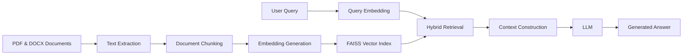

# Enterprise Knowledge Assistant

An AI-powered Knowledge Assistant that enables manufacturing teams to access operational knowledge through natural language queries. The system uses Retrieval-Augmented Generation (RAG) to retrieve relevant information from company documents and generate context-aware responses.

---

## Business Problem

Manufacturing organizations often maintain large volumes of operational documentation across multiple departments.

These documents typically include:

* Standard Operating Procedures (SOPs)
* Maintenance Manuals
* Troubleshooting Guides
* Quality Assurance Procedures
* Safety Guidelines

Employees frequently need information from these documents to perform daily tasks. Finding the right information often requires manually searching through multiple files, resulting in:

* Time-consuming document searches
* Delayed issue resolution
* Inconsistent access to operational knowledge
* Reduced productivity for engineering and operations teams

---

## Business Goal

Develop an AI-powered assistant that allows employees to ask questions in natural language and receive accurate answers grounded in company documentation.

Example Questions:

* How do I perform preventive maintenance on Machine X?
* What is the troubleshooting procedure for conveyor belt failure?
* What are the safety requirements before equipment inspection?
* What is the approved quality inspection process?

---

## Target Users

* Production Engineers
* Maintenance Engineers
* Quality Assurance Teams
* Operations Teams

---

## Solution Overview

The system processes manufacturing documents, converts them into searchable vector representations, retrieves relevant information based on user queries, and generates answers using a Large Language Model (LLM).

Instead of relying solely on model knowledge, responses are generated using retrieved document context, helping ensure answers remain aligned with company documentation.

---

# Architecture



---

## End-to-End Workflow

### Document Processing Pipeline

1. Documents are uploaded in PDF or DOCX format.
2. Text content is extracted from documents.
3. Documents are divided into smaller chunks.
4. Embeddings are generated for each chunk.
5. Chunks are indexed using FAISS for efficient retrieval.

### Query Processing Pipeline

1. User submits a natural language query.
2. Query embeddings are generated.
3. Relevant document chunks are retrieved using hybrid search.
4. Retrieved content is assembled into context.
5. Context is provided to the LLM.
6. The LLM generates a response based on retrieved information.
7. The answer is returned to the user.

---

## Key Features

### Document Ingestion

Supports ingestion of manufacturing documents in:

* PDF format
* DOCX format

### Text Extraction

Extracts text from operational documents while preserving useful content for downstream retrieval.

### Intelligent Chunking

Splits large documents into manageable chunks to improve retrieval accuracy and context relevance.

### Embedding Generation

Converts document chunks into vector representations for semantic search.

### Vector Search

Uses FAISS to store and retrieve document embeddings efficiently.

### Hybrid Retrieval

Combines semantic retrieval with keyword-based matching to improve relevance for technical manufacturing terminology.

### Context-Aware Response Generation

Builds context from retrieved document sections before generating responses through the LLM.

### FastAPI Integration

Exposes question-answering functionality through REST APIs.

### Deployment Support

Application components are containerized using Docker and deployed on AWS infrastructure.

---

## Example Query

### User Question

```text
What should be checked during preventive maintenance of the conveyor system?
```

### Retrieval Process

* Relevant maintenance manual sections are retrieved.
* Maintenance checklist documents are identified.
* Safety procedure references are included.

### Generated Response

```text
During preventive maintenance of the conveyor system, technicians should inspect belt alignment, roller condition, motor performance, lubrication levels, and safety guards. Follow lockout-tagout procedures before performing inspections.
```

---

## Project Structure

```text
enterprise-knowledge-assistant/

├── data/
│   ├── documents/
│   └── processed/
│
├── ingestion/
│   ├── text_extraction.py
│   ├── chunking.py
│   └── embeddings.py
│
├── retrieval/
│   ├── vector_store.py
│   └── hybrid_retrieval.py
│
├── api/
│   └── main.py
│
├── faiss_index/
│
├── requirements.txt
├── Dockerfile
├── README.md
└── .gitignore
```

---

## Technology Stack

* Python
* FastAPI
* LangChain
* OpenAI API
* FAISS
* PostgreSQL
* Docker
* AWS EC2

---

## Technical Concepts Demonstrated

* Retrieval-Augmented Generation (RAG)
* Semantic Search
* Hybrid Retrieval
* Vector Databases
* Embedding-Based Search
* Prompt Engineering
* Context Construction
* FastAPI Development
* Document Intelligence
* Knowledge Retrieval System
---

## Learning Outcomes

Through this project, I gained practical experience with:

* Building end-to-end RAG systems
* Designing document ingestion pipelines
* Implementing semantic and hybrid retrieval
* Working with vector embeddings and FAISS
* Prompt engineering for domain-specific applications
* Developing FastAPI-based AI services
* Deploying containerized applications on AWS
* Solving knowledge retrieval challenges in enterprise environments

```
```
